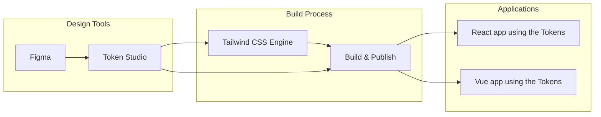

# Kurocado Studio Figma to Framework Theming Framework

| Platform        | URL                                                                                |
| --------------- | ---------------------------------------------------------------------------------- |
| React Storybook | [figma-to-framework-react.vercel.app](https://figma-to-framework-react.vercel.app) |
| Vue Storybook   | [figma-to-framework-vue.vercel.app](https://figma-to-framework-vue.vercel.app)     |

## Demo

[](https://youtu.be/RBpAYT4iMuU)

## Overview

This project is an internal R&D proof-of-concept from **Kurocado Studio**, focused on building a  
**token-based theming framework** to power cross-framework design system pipelines.

It serves as the **technical foundation of the Kurocado Design System**, enabling reusable, themable
components that sync directly with **Figma** using **Token Studio**. This work will eventually drive
both the **React** and **Vue** implementations within Figma and Storybook, forming a closed loop
between design and code.

The core workflow explores how tokens created in Figma flow through Token Studio and Tailwind CSS,
propagating real-time design updates into framework-specific component libraries.

## Vision

- Enable **framework-agnostic theming** through design tokens
- Support **real-time design → code** updates with Token Studio
- Create a **scalable build pipeline** for multi-framework UI kits
- Serve **multi-client design governance** with consistent token layers
- Lay the groundwork for an **open-source, design-token–driven design system**

This R&D initiative is designed to validate ideas around theme portability, token modeling, and
scalable component architecture across React and Vue environments.

## Technical Architecture

This project uses a token‑driven pipeline, where design tokens from Figma flow through Token Studio
and Tailwind CSS to power component libraries in React and Vue.



## Prerequisites

- **Node.js v20 or higher** – [Download Node.js](https://nodejs.org/)
- **PNPM** – [Install PNPM globally](https://pnpm.io/installation):

  ```bash
  npm install -g pnpm
  ```

## Getting Started

### 1. Clone the repository

```bash
git clone https://github.com/Kurocado-Studio/figma-to-framework.git
cd figma-to-framework
```

### 2. Install dependencies

```bash
pnpm install
```

### 3. Run Storybook locally

```bash
pnpm run dev
```
