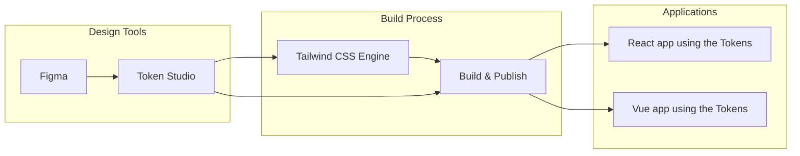
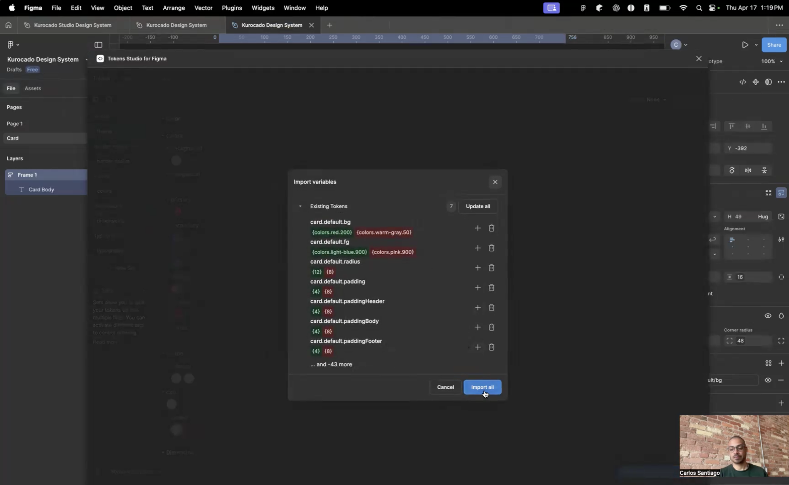

# Kurocado Studio Theming Framework (R&D PoC)

|                 |                                                        |
| --------------- | ------------------------------------------------------ |
| React Storybook | <https://design-system-kurocado-studio.vercel.app>     |
| Vue Storybook   | <https://design-system-vue-kurocado-studio.vercel.app> |


## 🧪 Experimental Scope & Current Focus

This project is an R\&D proof-of-concept (PoC) exploring automated design-to-code workflows. It aims to bridge **Figma** with **React** and **Vue** components using a token-based theming framework.

The core idea: update tokens in Figma → sync with code using **Token Studio** → see pixel-perfect updates instantly reflected in Storybook environments. The setup supports Tailwind CSS and is monorepo-friendly.

While it may resemble a design system, this project is not one—at least not yet. It is a **component theming framework experiment** intended to validate ideas around design token portability, multi-framework support, and scalable styling architecture.

## 🎯 Vision

The project investigates:

* Cross-framework token theming for React + Vue
* Low-friction, token-first design system modeling
* Real-time Figma → Code propagation via Token Studio
* Portable build pipeline for framework-agnostic UI kits
* Governance strategies for multi-client SDKs

If successful, this could evolve into a plug-and-play design infrastructure kit for product teams looking to maintain consistency across platforms without the overhead of managing a full design system.

## 🛠️ Technical Architecture

A token‑driven pipeline where design tokens from Figma flow through Token Studio and Tailwind CSS to power component libraries in React and Vue.



## ⚡ Demo

[](https://youtu.be/RBpAYT4iMuU)

---

## 🔧 Prerequisites

* **Node.js v20 or higher**
  [Download Node.js](https://nodejs.org/)

* **PNPM**
  [PNPM Installation Guide](https://pnpm.io/installation)
  Install globally:

  ```bash
  npm install -g pnpm
  ```

---

## 🚀 Getting Started

```bash
git clone https://github.com/Kurocado-Studio/design-system.git
cd design-system
pnpm install
pnpm run setup
```

---

## 🛠 Development Scripts

* Run Storybook:

  ```bash
  pnpm run dev
  ```
* Build packages:

  ```bash
  pnpm run build
  ```
* Run tests:

  ```bash
  pnpm run test
  ```
* Lint:

  ```bash
  pnpm run lint
  ```
